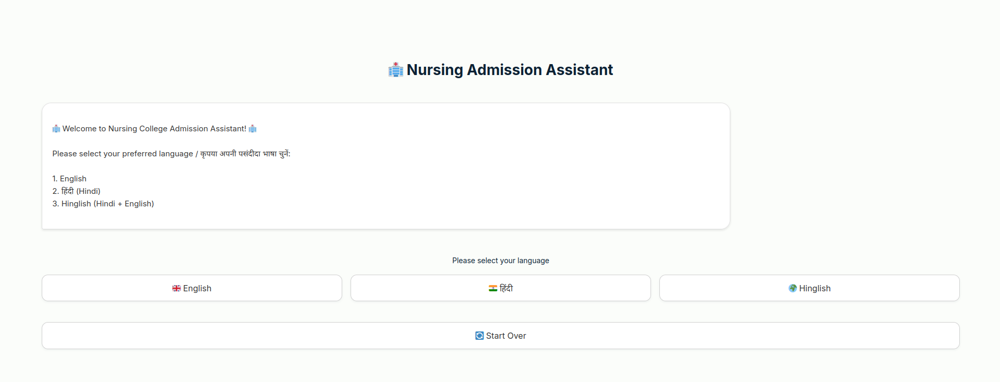
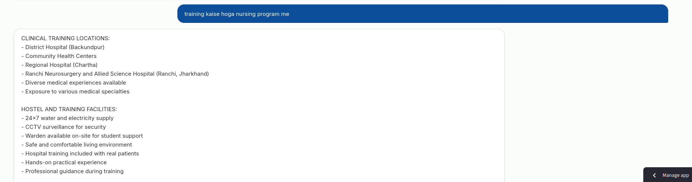
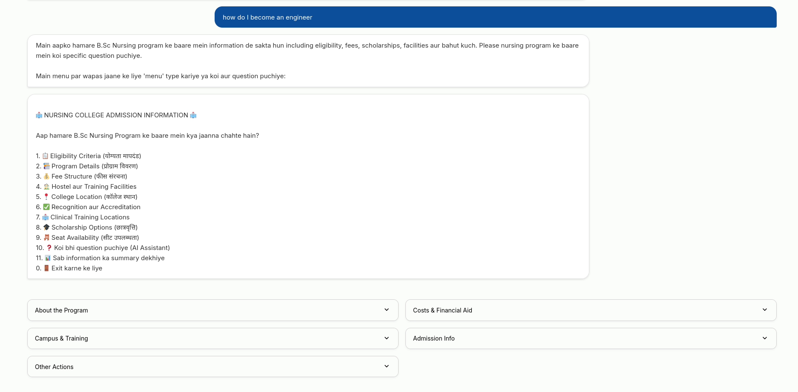

# Nursing College Admission Assistant - LIA PLUS AI Assignment

## Overview

This project implements an intelligent conversational AI system designed to assist prospective students with nursing college admission inquiries. The chatbot leverages advanced prompting techniques and Retrieval-Augmented Generation (RAG) to provide accurate, contextual information about B.Sc Nursing programs.

## 🚀 Live Demo

[Click here to try the app](https://collegeadmissionassistant-zqytrmum3be57w8qp6b8eq.streamlit.app/)

## Objective

The primary goal is to build a prompt-guided LLM that can effectively guide students through the nursing college application process by incorporating multiple sophisticated prompting techniques while maintaining reliable and integral information delivery.

## Model Selection: Llama-4-Maverick-17B

**Llama Maverick** was specifically chosen for this implementation due to:

- **Cost Efficiency**: Significantly lower operational costs compared to larger models
- **Optimal Model Size**: 17B parameters provide sufficient capability for conversational tasks without unnecessary overhead
- **Task-Specific Performance**: Perfectly suited for structured dialogue and information retrieval tasks
- **Resource Optimization**: Efficient enough to handle this specific use case without requiring extensive computational resources

The model strikes an ideal balance between performance and efficiency, making it the perfect choice for this nursing admission assistant application.

## Advanced Prompting Techniques

### 1. Role-Based Prompting
The system establishes a clear AI persona as a "Nursing College Admission Counselor," ensuring consistent and professional responses throughout the conversation.

### 2. Phase-Based Conversational Design
Structured conversation flow through distinct phases:
- Greeting & Language Selection
- Main Menu Navigation  
- Information Delivery
- AI Assistant Mode
- Conversation Closure

### 3. Multi-Example Prompting
Explicit pattern definitions for intent recognition:

**Positive Response Patterns:**
- English: 'Yes', 'Sure', 'Tell me more', 'Okay', 'I'm interested'
- Hindi: 'Haan', 'Acha', 'Batao', 'Theek hai', 'Jaanna chahta hun'
- Hinglish: Mixed patterns combining both languages

**Negative Response Patterns:**
- English: 'No', 'Not interested', 'Maybe later'
- Hindi: 'Nahi', 'Interest nahi hai', 'Baad mein'

### 4. Constraint-Based Prompting
Clear boundaries and limitations are set:
- Responses limited to nursing program and admission-related topics
- Mandatory language consistency throughout conversations
- Structured redirection for off-topic queries

### 5. Intent Detection & Pattern Recognition
The system uses sophisticated pattern matching to identify user intentions:

```
POSITIVE INTENT:
User: "Haan batao college ke baare mein"
Detection: Positive (contains "Haan" + "batao")
Action: Continue to next conversation step

NEGATIVE INTENT:
User: "Nahi yaar, not interested"
Detection: Negative (contains "Nahi" + "not interested")
Action: Polite conversation closure

UNCLEAR INTENT:
User: "Hmm, pata nahi"
Detection: Unclear (hesitation words)
Action: Ask for clarification
```

## Core System Prompt

```
You are an AI admission counselor for a Nursing College. Always respond in {selected_language}.

RELEVANT COLLEGE INFORMATION: {relevant_info}

CONVERSATION PHASES:
1. Greeting & Language Selection
2. Main Menu Navigation
3. Information Delivery
4. AI Assistant Mode
5. Conversation Closure

ROLES & GUIDELINES:
- Be professional, helpful, and concise
- Provide accurate information only from the given context
- If asked about topics not in the context, redirect: "I can only answer questions related to the nursing program and admission process"
- Always maintain the specified language throughout
- Ask follow-up questions to guide the conversation forward

INTENT DETECTION EXAMPLES:
[Detailed examples for positive, negative, and unclear intents]

CONVERSATION CLOSURE EXAMPLES:
[Specific templates for different closure scenarios]
```

## RAG Implementation

The system implements Retrieval-Augmented Generation to:
- Store college information in a separate file (`college_info.txt`)
- Retrieve relevant information based on query keywords
- Keep prompts clean and token-efficient
- Ensure accurate, up-to-date information delivery

### Information Categories
- Eligibility Criteria
- Program Details
- Fee Structure
- Hostel & Training Facilities
- College Location
- Recognition & Accreditation
- Clinical Training Locations
- Scholarship Options
- Seat Availability

## Multi-Language Support

The system supports three language modes:
- **English**: Complete English responses
- **Hindi**: Native Hindi language support
- **Hinglish**: Hindi-English code-mixing for natural communication

## Temperature Configuration

The model operates with a **low temperature setting (0.7)** to ensure:
- Deterministic responses
- Consistent information delivery
- Reliable pattern recognition
- Professional conversation tone

## Key Features

- **Structured Menu Navigation**: Organized information access through numbered menus
- **Context-Aware Responses**: RAG-powered relevant information retrieval
- **Intent Recognition**: Advanced pattern matching for user intention detection
- **Graceful Conversation Closure**: Professional handling of negative or unclear responses
- **Language Consistency**: Maintains selected language throughout the session
- **Error Handling**: Robust fallback mechanisms for unexpected inputs

## Technical Architecture

- **College Info RAG**: Handles information retrieval and section parsing
- **Nursing Admission Bot**: Main conversation management and state handling
- **Conversation State**: Enum-based state management for conversation flow
- **Azure AI Integration**: LLM service integration for response generation

This implementation demonstrates how sophisticated prompting techniques can create a reliable, efficient, and user-friendly admission assistance system while maintaining cost-effectiveness through optimal model selection.

## Chat flow diagram


## Chat examples




